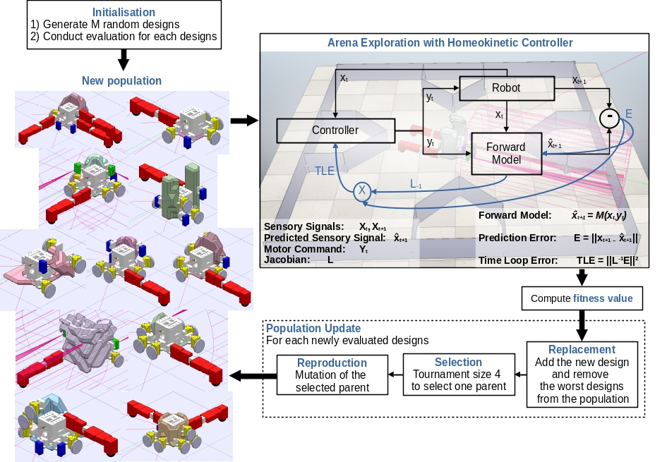
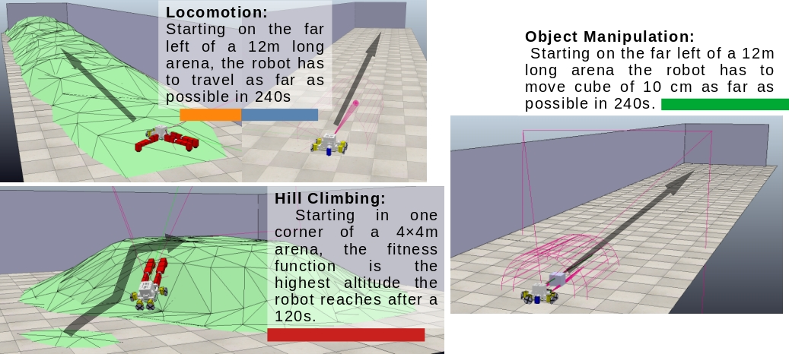
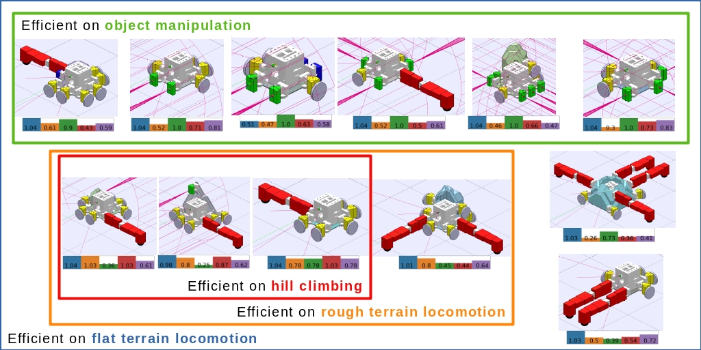
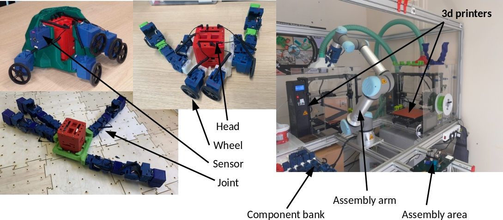
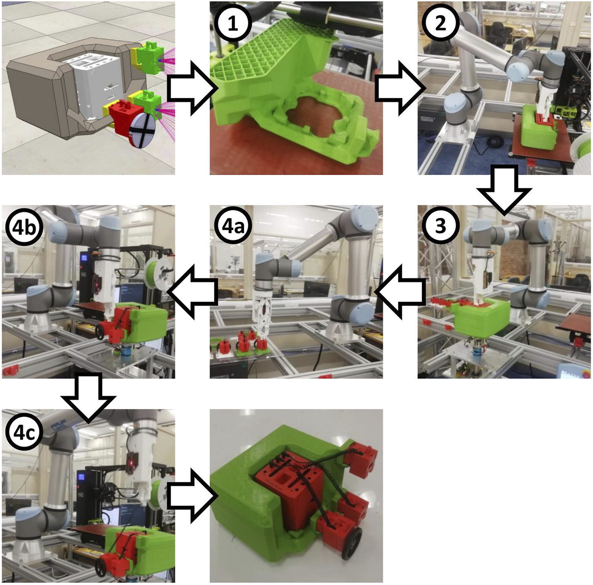
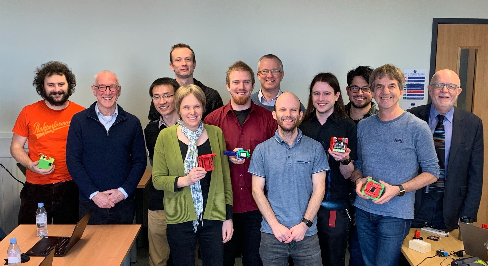

## Efficient and diverse generative robot designs using evolution and intrinsic motivation (2025) 

*Work done in collaboration with Simon C. Smith*

[[Paper](https://ieeexplore.ieee.org/abstract/document/11127289)] [[Source Code](https://github.com/AutonomousRoboticEvolution/AREFramework/tree/icra_2025)]

Methods for generative design of robot physical configurations can automatically find optimal and innovative solutions for challenging tasks in complex environments. The vast search-space includes the physical design-space and the controller parameter-space, making it a challenging problem in machine learning and optimisation in general. Evolutionary algorithms (EAs) have shown promising results in generating robot designs via gradient-free optimisation. Morpho-evolution with learning (MEL) uses EAs to concurrently generate robot designs and learn the optimal parameters of the controllers. Two main issues prevent MEL from scaling to higher complexity tasks: i) computational cost and ii) premature convergence to sub-optimal designs. To address these issues, we propose combining morpho-evolution with intrinsic motivations. Intrinsically motivated behaviour arises from embodiment and simple learning rules without external guidance. We use a homeokinetic controller that generates exploratory behaviour in a few seconds with minimal knowledge of the robot's design. Homeokinesis replaces costly learning phases, reducing computational time and favouring diversity, preventing premature convergence. We compare our approach with current MEL methods in several downstream tasks. The generated designs score higher in all the tasks, are more diverse, and are quickly generated compared to morpho-evolution with static parameters.

In this work, we are using the ARE framework. See next section.

### Morpho-Evolution with Homeokinesis

MEHK consists of two parts: Asynchronous Morpho-Evolution (AME) and Homeokinetic controller (HKC) algorithms. AME is responsible for generating candidates designs and HKC to explore their sensori-motor spaces. The fitness function used for AME is an exploration score measuring how much area the robot covered in a single episode. HKC is a process falling into the category of intrinsic motivation balancing two conflicting objective functions: predictability and sensitivity. Predictability is measured with the prediction error of the next state of a forward model (trained online). The sensitivity is measured with the Jacobian of the controller (trained online). Measuring the exploration score while a robot is controlled by HKC is good proxy of the robot's functionality.

### Training a selection of robots generated by MEHK

Ten thousand robots were generated by MEHK, three with the best exploration are selected to be trained on four downstream tasks. The experiments where replicated thirty times, so ninety robots were trained using a variant of CMA-ES.

Here is a handpicked set of robot designs generated and trained. Under each image their fitness scores for each task is indicated with additionally their exploration scores in purple.

## Autonomous Robot Evolution Project (2018-2023)

<iframe width="560" height="315" src="https://www.youtube.com/embed/4l8n8UD3e-Y?si=3A1U72r06F2Prbwd" title="YouTube video player" frameborder="0" allow="accelerometer; autoplay; clipboard-write; encrypted-media; gyroscope; picture-in-picture; web-share" referrerpolicy="strict-origin-when-cross-origin" allowfullscreen></iframe>

The ARE was a research project funded by EPSRC, putting together a research team from University of York, Bristol Robotic Lab, Vrije Universitat Amsterdam and Edinburgh Napier University. 

The goal of this project was to:
- Develop a novel robotic platform bringing the field of evolutionary robotic beyond modular robots
- Improve the evolution of robot designs
- Enable evolution of physical robots by automating the assembly of robots.

Selected papers:
- [Le Goff, Léni K., et al. "Morpho evolution with learning using a controller archive as an inheritance mechanism." (2022)](https://ieeexplore.ieee.org/abstract/document/9701596)
- [Angus, Mike, et al. "Practical hardware for evolvable robots." (2023)](https://www.frontiersin.org/journals/robotics-and-ai/articles/10.3389/frobt.2023.1206055/full)
- [Hale, Matthew F., et al. "Hardware design for autonomous robot evolution." (2020)](https://ieeexplore.ieee.org/abstract/document/9308204/)

### The ARE robotic platform

### ARE workflow
<iframe width="560" height="315" src="https://www.youtube.com/embed/ePGhi3s411M?si=KmsljyPyysou4Vf8" title="YouTube video player" frameborder="0" allow="accelerometer; autoplay; clipboard-write; encrypted-media; gyroscope; picture-in-picture; web-share" referrerpolicy="strict-origin-when-cross-origin" allowfullscreen></iframe>

These robots are created by an autonomous production process. To create a new robot, a body plan is first evolved in simulation. This determines the morphology of the chassis and the placement of components upon it to form a complete robot. The chassis is 3D printed 1), and then the complete robot design is autonomously assembled by a robot arm (2–4c). To assemble it, the robot arm first inserts the head organ into the chassis 2), which is still stuck to the build plate of the 3D printer. The head organ is secured in place by a sprung clip mechanism in its base, mating with corresponding structures that have been integrated directly into the plastic of the chassis when it was printed. The head organ then provides a secure grasping point for the robot arm to pull the printed chassis off the build plate of the printer and place it onto an assembly stand 3). The peripheral components have their own sprung clip mechanisms in their casings, allowing the robot arm to attach each of them to matching mating points printed into the chassis. The connecting cable for each organ is stored within an onboard cavity, from which it can be drawn out by the robot arm and connected to the head organ to complete the assembly (4a–4c). The robot then wirelessly receives its control algorithm and is ready for operation. 

### The ARE Team

